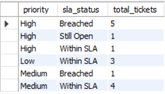
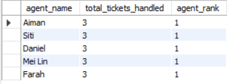
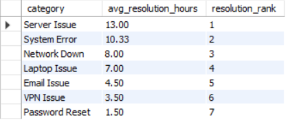
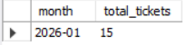
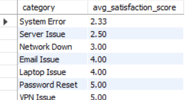
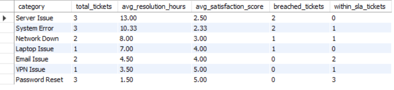

# SQL IT Support Ticket Analysis

## Project Overview
This project analyzes IT support ticket operations using SQL and dummy operational data. The project was designed to simulate a real-world IT support environment by tracking ticket volume, SLA breaches, resolution performance, agent workload, and customer satisfaction.

The analysis focuses on identifying operational bottlenecks, monitoring service performance, and generating business insights that can support IT service improvement initiatives.

---

## Objectives
- Analyze support ticket volume and distribution
- Monitor SLA compliance and breach patterns
- Evaluate average resolution time
- Measure agent workload distribution
- Assess customer satisfaction trends
- Generate operational business insights using SQL

---

## Tools & Technologies
- SQL
- MySQL
- Relational Database Design

---

## SQL Concepts Used
- JOINs
- GROUP BY
- CASE WHEN
- Common Table Expressions (CTEs)
- Window Functions
- Aggregate Functions
- Ranking Functions

---

## Database Schema


---

## Project Structure

```text
IT-Support-Ticket-Analysis/
│
├── README.md
├── schema.sql
├── insert_data.sql
├── analysis_queries.sql
├── insights.md
│
└── screenshots/
    ├── er_diagram.png
    ├── full_ticket_performance_summary.png
    ├── sla_breach_analysis.png
    ├── agent_workload_ranking.png
    ├── category_resolution_ranking.png
    ├── monthly_ticket_trend.png
    └── customer_satisfaction_analysis.png
```

---

## Key Analysis & Results

### SLA Breach Analysis
Tracks SLA compliance based on ticket priority and resolution time.



---

### Agent Workload Ranking
Ranks support agents based on total tickets handled using SQL window functions.



---

### Category Resolution Time Ranking
Identifies ticket categories with the longest average resolution time.



---

### Monthly Ticket Trend
Analyzes support demand trends over time.



---

### Customer Satisfaction Analysis
Measures average satisfaction score across ticket categories.



---

### Full Ticket Performance Summary
Comprehensive operational summary by ticket category, including:
- total tickets
- SLA breaches
- resolution time
- customer satisfaction



---

## Business Insights
- High-priority tickets experienced the highest SLA breach rate
- Certain ticket categories required significantly longer resolution time
- Workload distribution between agents was uneven
- Categories with longer resolution time generally showed lower customer satisfaction
- Ticket volume trends may indicate recurring operational issues

---

## Future Improvements
- Add Power BI dashboard visualization
- Integrate larger datasets
- Implement stored procedures and triggers
- Add predictive ticket trend analysis using Python

---

## Author
Ash — Data Analytics Graduate focused on SQL, Business Intelligence, and IT Analytics.
